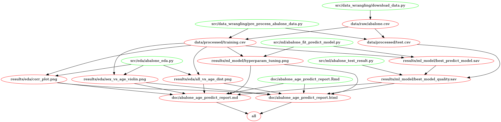

# Abalone Age Prediction
### Author
---
- [Huanhuan Li](https://www.linkedin.com/in/huanhuanli1003/), student from [UBC MDS Program](https://masterdatascience.ubc.ca/) (2020 - 2021)
- [Chuang Wang](https://www.linkedin.com/in/chuangw/), student from [UBC MDS Program](https://masterdatascience.ubc.ca/) (2020 - 2021)
- Charles Suresh, student from [UBC MDS Program](https://masterdatascience.ubc.ca/) (2020 - 2021)
### Project Information
---

- **Background**   
In this project, we are going to estimate abalone's age from physical measurements. Abalone is a kind of shellfish that lives in cold water. It has great health benefits based on the fact of low fat and high protein. The nutritional value in different ages is different, as well as economic value. Therefore, telling the age of abalone is an important question for scientists, fish farmers, and customers. The traditional way to determine the age of abalone is from the number of rings. Counting the rings is a time-consuming task since it requires a tedious process involving cutting the shell, staining it, and counting the rings under the microscope. Thus, we consider using other easily obtained measures to predict the age. 

- **Analysis**           
To predict abalone's age from physical measurements, we build a regression model using a popular type of regularized linear regression model Ridge. The model can use the physical measurements (Sex, Length, Diameter, Height, Whole weight, etc.) to predict the age of abalone. Our final Ridge model can predict age in a decent accuracy on an unseen test data set, with a R-squared score of 0.52 and a mean absolute percentage error (MAPE) of 13.71. However, considering the potential economic losses to the stakeholders, we recommend further improvement before it is put into the industry.

- **Dataset**  
The dataset used in this project comes from an original study "The Population Biology of Abalone (_Haliotis_ species) in Tasmania. I. Blacklip Abalone (_H. rubra_) from the North Coast and Islands of Bass Strait", created by Warwick J Nash, Tracy L Sellers, Simon R Talbot, Andrew J Cawthorn and Wes B Ford (1994). It was sourced from the UCI Machine Learning Repository and can be found [here](http://archive.ics.uci.edu/ml/machine-learning-databases/abalone/). Each row in the data set represents an abalone, including the physical measurements(Sex, Length, Diameter, Height, Whole weight, etc.) and the number of rings, which gives the age in years by adding 1.5. The missing values in the original study have been removed and the range of continuous values has been scaled. Please find the detailed information [here](http://archive.ics.uci.edu/ml/datasets/Abalone?pagewanted=all).

### Report
---
The final report can be found [here](https://github.com/UBC-MDS/Abalone_Age_Prediction/blob/main/doc/abalone_age_predict_report.md).


### Usage 
---
To replicate the analysis,  

1. Clone this GitHub repository.  
2. Navigate to the root directory of this repository.
3. Make sure Docker is installed in your device. (You can install Docker [here](https://docs.docker.com/get-docker/).)
4. Pull the [docker image](https://hub.docker.com/r/chuangw/abalone_age_prediction) which contains the software and libraries/packages needed to run abalone age prediction Machine Learning (ML) pipeline.   
   > `docker pull chuangw/abalone_age_prediction:latest`
5. To run this analysis using Docker, type the following (filling in PATH_ON_YOUR_COMPUTER with the absolute path to the root of this project on your computer).   
   > `docker run --rm -v PATH_ON_YOUR_COMPUTER:/home/rstudio/Abalone_Age_Prediction chuangw/abalone_age_predictor make -C /home/rstudio/Abalone_Age_Prediction all`
6. To clean up the analysis, type:    
   > `docker run --rm -v PATH_ON_YOUR_COMPUTER:/home/rstudio/Abalone_Age_Prediction chuangw/abalone_age_predictor make -C /home/rstudio/Abalone_Age_Prediction clean`

### **Flow Chart and Project Organization**
--- 
- **Flow Chart**    


> ***The whole analysis process including running all scripts and rendering R markdown is automated in the pipeline written in the [`Makefile`](Makefile). And this can be run using Docker (see above).***

- **Project Organization**    
```
.
├── CODE_OF_CONDUCT.md
├── CONTRIBUTING.md
├── Dockerfile
├── LICENSE
├── Makefile
├── README.md
├── data
│   ├── processed
│   │   ├── test.csv
│   │   └── training.csv
│   └── raw
│       └── abalone.csv
├── doc
│   ├── abalone_age_predict_report.Rmd
│   ├── abalone_age_predict_report.html
│   ├── abalone_age_predict_report.md
│   └── abalone_age_refs.bib
├── env-abalone.yml
├── img
│   ├── out.png
│   ├── output.dot
│   └── project_flow_chart.png
├── results
│   ├── eda
│   │   ├── all_vs_age_dist.png
│   │   ├── corr_plot.png
│   │   └── sex_vs_age_violin.png
│   └── ml_model
│       ├── best_model_quality.sav
│       ├── best_predict_model.sav
│       └── hyperparam_tuning.png
└── src
    ├── data_wrangling
    │   ├── download_data.py
    │   └── pre_process_abalone_data.py
    ├── eda
    │   ├── abalone_eda.ipynb
    │   └── abalone_eda.py
    └── ml
        ├── abalone_fit_predict_model.py
        └── abalone_test_result.py
```

### Dependencies
---
Please refer to [env-abalone.yml](/env-abalone.yml) under the root directory of this project.
Run the following command from the root of this repository to replicate the enviroment for this project.

`conda env create --file env-abalone.yml`
### **License**
---
[](https://github.com/UBC-MDS/Abalone_Age_Prediction/blob/main/LICENSE)

### References
---
<div id="refs" class="references">

<div id="ref-Dua2019">

- Dua, D. and Graff, C. (2019). UCI Machine Learning Repository [http://archive.ics.uci.edu/ml]. Irvine, CA: University of California, School of Information and Computer Science.

- Data comes from an original (non-machine-learning) study:
Warwick J Nash, Tracy L Sellers, Simon R Talbot, Andrew J Cawthorn and Wes B Ford (1994)
"The Population Biology of Abalone (_Haliotis_ species) in Tasmania. I. Blacklip Abalone (_H. rubra_) from the North Coast and Islands of Bass Strait",
Sea Fisheries Division, Technical Report No. 48 (ISSN 1034-3288)

</div>

</div>
