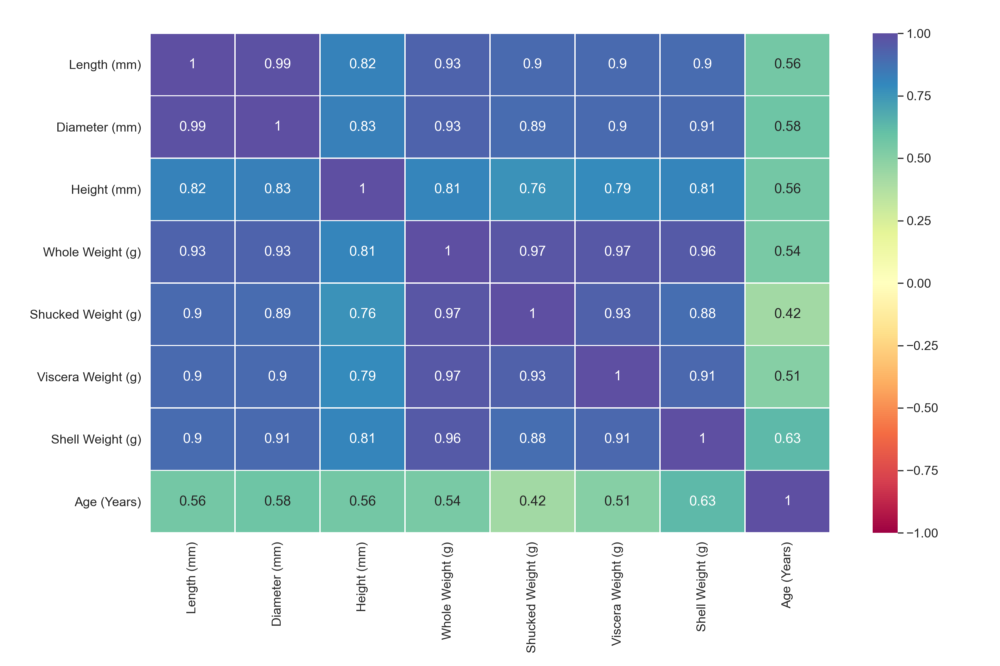
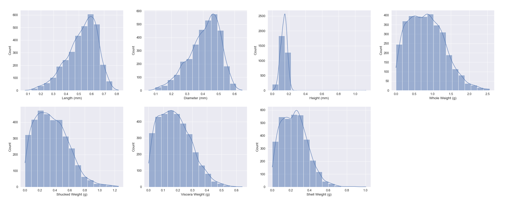
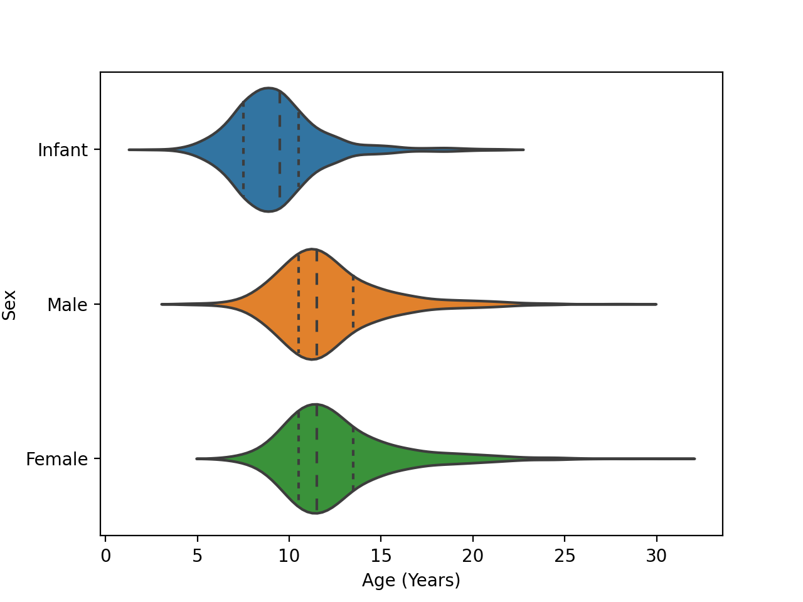
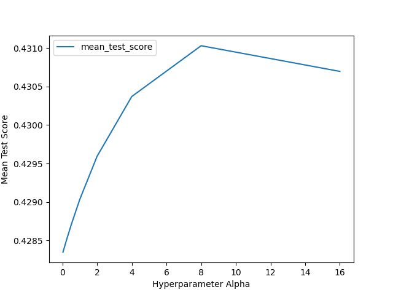

```{r setup, include=FALSE}
knitr::opts_chunk$set(echo = FALSE)
library(knitr)
library(reticulate)
reticulate::use_python("/opt/conda/bin/python3")
```

```{python load model results}
import pandas as pd
import pickle
model_quality = pickle.load(open("../results/ml_model/best_model_quality.sav", "rb"))
```

# Summary

To predict abalone's age from physical measurements, we build a regression model using a popular type of regularized linear regression model Ridge. The model can use physical measurements (Sex, Length, Diameter, Height, Whole weight, etc.) to predict the age of abalone. Our final Ridge model can predict age in a decent accuracy on an unseen test data set, with a R-squared score of `r round(py$model_quality$r_squared_score[1],2)` and a mean absolute percentage error (MAPE) of `r round(py$model_quality$mape_error[1],2)`.
However, considering the potential economic losses to the stakeholders [@abalone], we recommend further improvement before it is put into the industry.

# Methods

## Data
The dataset used in this project comes from an original study "The Population Biology of Abalone (_Haliotis_ species) in Tasmania. I. Blacklip Abalone (_H. rubra_) from the North Coast and Islands of Bass Strait", created by Warwick J Nash, Tracy L Sellers, Simon R Talbot, Andrew J Cawthorn and Wes B Ford (1994). It was sourced from the UCI Machine Learning Repository [@Dua2019] and can be found [here](http://archive.ics.uci.edu/ml/machine-learning-databases/abalone/). Each row in the data set represents an abalone, including the physical measurements (Sex, Length, Diameter, Height, Whole weight, etc.) and the number of rings, which gives the age in years by adding 1.5. The missing values in the original study have been removed and the range of continuous values has been scaled. Please find the detailed information [here](http://archive.ics.uci.edu/ml/datasets/Abalone?pagewanted=all).


## Analysis
The Ridge model was used to build a regression model to predict abalone age based on the physical measures, which involve 1 categorical feature ("Sex"), and 7 numerical features ("Length", "Diameter", "Height", "Whole weight", "Shucked weight", "Viscera weight", and "Shell weight"). All features are contained in the original data set. The predicting target "age" is converted from the "rings" in the original data set by adding 1.5. Before fitting the model, we exclude 1 outlier with extremely large height, and apply a standard scale transformation on numerical features. The model parameter $alpha$ was chosen using a randomized search on hyperparameters in 5-fold cross-validation, with R-squared score as the evaluation metric.


The Python programming languages [@Python] and the following Python packages were used to perform the analysis: Docopt [@docoptpython], Pandas [@pandas], Seaborn [@seaborn], Scikit-learn [@sklearn], Numpy [@numpy], Pickle [@pickle], Matplotlib [@hunter2007matplotlib]. The R language programming languages [@R], Knitr [@knitr], and Reticulate [@reticulate] were used to generate this report. The code used to perform the analysis and create this report can be found here: https://github.com/UBC-MDS/Abalone_Age_Prediction.

# Results & Discussion

To determine which features are useful to predict the target, we explore all columns in the train data set. From the correlation heat map below, we can see that the shell weight is the feature that is most correlated to the target Age because the correlation value is the largest among all features. All numerical features have a positive relationship with each other.

```{r plot corr heatmap, fig.width=10, fig.height=3,fig.cap="Figure 1. Correlation of All Abalone Numerical Column.",out.width="100%"}

```


To examine the correlation between the target Age and numerical features, we take a further step to plot the histogram plot below. We can see that the target Age is positively correlated with all the numerical features. From the distributions, we can see that all feature values are not normally distributed. There are some outliers for the Height value, but we will exclude outliers from the training dataset before building models. The feature "Whole Weight" distributes from 0 to 2.5, which is a wider range than other features. Other features distribute from 0 to around 1. Thus, we are going to standardize the numerical values before fitting the model.

```{r plot scatter, fig.width=10, fig.height=3,fig.cap="Figure 2. Correlation of Abalone Age with Numerical Features.",out.width="100%"}

```

Then we explore the age distribution conditioning by different Sex. The number of instances of Infants, Males and Females are pretty close to each other. The mean, median, 25% Quartile and 75% Quartile of Age for Infants are all lower than that for Males and Females. This categorical feature is relationship indicator of age.

```{r plot voilin, fig.width=10, fig.height=3,fig.cap="Figure 3. Correlation of Abalone Age with Sex.",out.width="50%"}

```

In summary, after exploring the data, we can clearly see that all features have a relationship with the target. Thus, we are going to use all features as the model input. 


# Results & Discussion


We chose to use Ridge model to solve the regression problem. To find the best hyperparameter, we randomly search within the defined search space of "alpha" using 5-fold cross-validation. The evaluation metric used in the cross-validation is R-squared score, which indicates the variation in the response variable around its mean. The best mean validate score is 0.54 where 'alpha' equals 1. 

```{r param tuning, fig.width=10, fig.height=3,fig.cap="Figure 4. Results from 5-fold cross validation to choose alpha. R-squared was used as the metric as alpha was varied.",out.width="50%"}

```
The final prediction model has a R-squared score of `r round(py$model_quality$r_squared_score[1],2)` and a mean absolute percentage error (MAPE) of `r round(py$model_quality$mape_error[1],2)`. Our R-squared score is not good enough compare to the perfect R-squared score of 1, which means our prediction has a relatively large variation in the response variable around its mean. Considering the MAPE score, the model has around `r round(py$model_quality$mape_error[1],2)`% errors on the age prediction. In terms of MAPE score, the model performs good based on the test data. However, this model is not good enough to implement in industry or other fields.

```{R model quality}
kable(py$model_quality, 
      caption = "Table 1. Model Performance on Test Data"
) 
```

# Further improvement
We consider that the physical measurements might not be linearly increased by age. The true underlying relationship is more complex than a linear relationship considering multiple features. We suggest the following methods to enhance the model performance for further improvement.
First, we could treat the age prediction as a classification problem by binning the age into several age classes. Second, we could further investigate the collinear features (features that are highly correlated with one another [@kiers2007comparison]), or the outliers in each feature. We could also apply other feature engineering techniques, such as polynomial regression or feature interaction, to find a better fit. Last, for the reason of the collinear relationship between features, we may reduce features using feature selection methods to simplify the model.

# Reference


